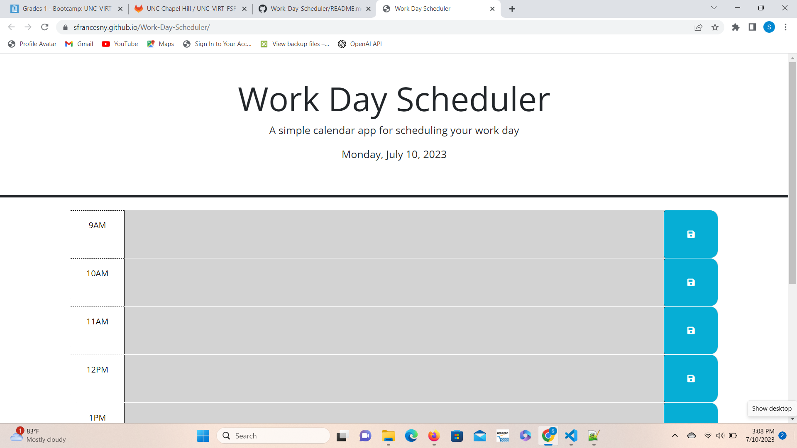
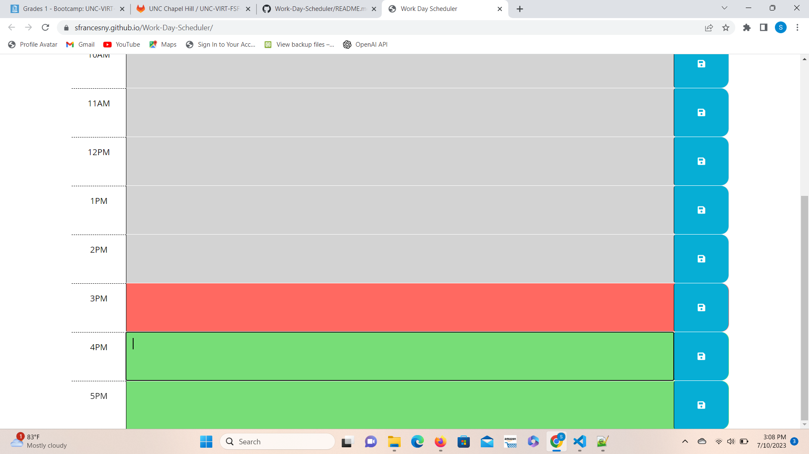

# 05 Third-Party APIs: Work Day Scheduler
<!-- On-the-job ticket or feature request Challenges -->

## Description 
This is a simple calendar application that allows a user to save events for each hour of a typical working day (9am–5pm). This app will run in the browser and feature dynamically updated HTML and CSS powered by jQuery.

## User Story

```md
AS AN employee with a busy schedule
I WANT to add important events to a daily planner
SO THAT I can manage my time effectively
```

## Acceptance Criteria

```md
GIVEN I am using a daily planner to create a schedule
WHEN I open the planner
THEN the current day is displayed at the top of the calendar
WHEN I scroll down
THEN I am presented with timeblocks for standard business hours of 9am&ndash;5pm
WHEN I view the timeblocks for that day
THEN each timeblock is color coded to indicate whether it is in the past, present, or future
WHEN I click into a timeblock
THEN I can enter an event
WHEN I click the save button for that timeblock
THEN the text for that event is saved in local storage
WHEN I refresh the page
THEN the saved events persist
```

## Usage 
 This application establishes a predictable routine that reduces stress and improves efficiency for a typical work day. It makes decision-making easier, eliminates uncertainties, and builds healthy habits to manage your time and energy better. This falls under productivity planning and goal management.

 ## Screenshots

 

Link: https://sfrancesny.github.io/Work-Day-Scheduler/

## Resources
https://chat.openai.com/
